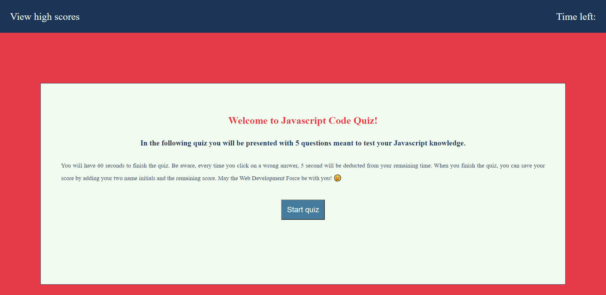
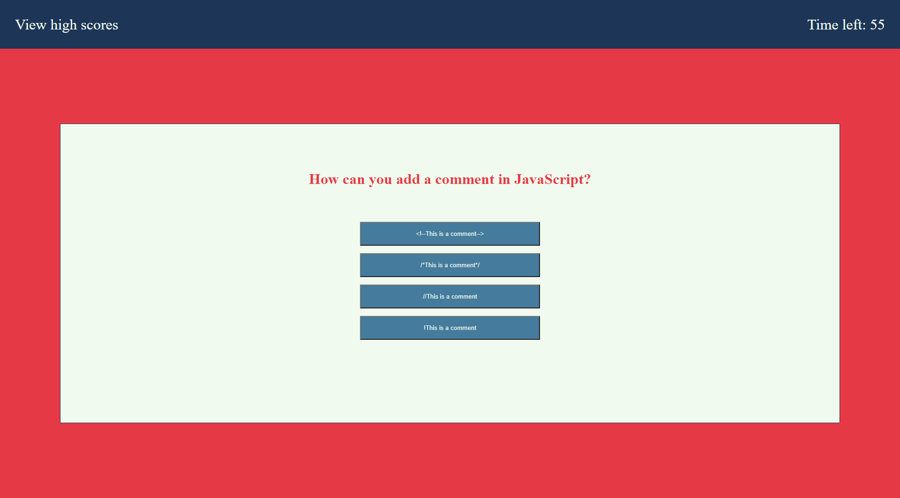
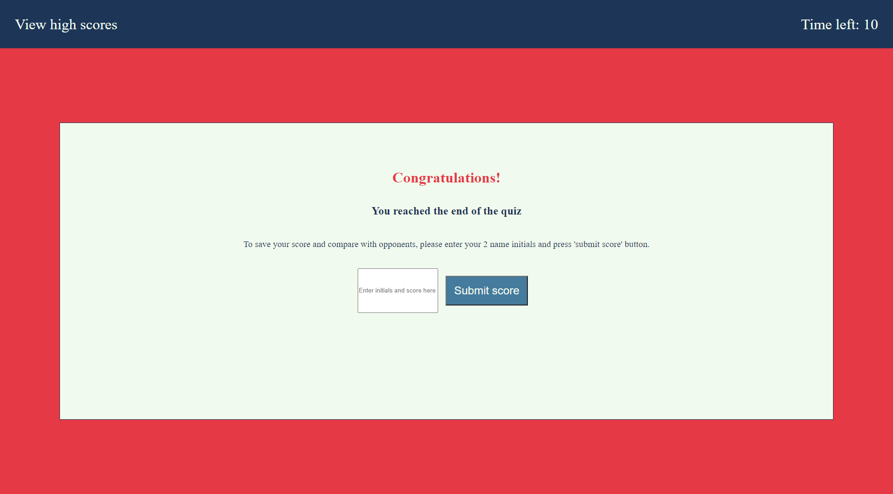
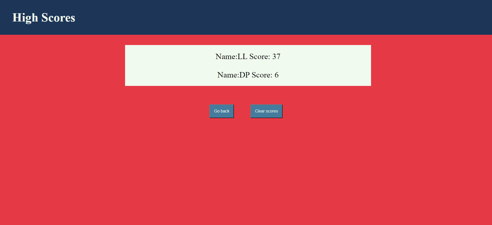
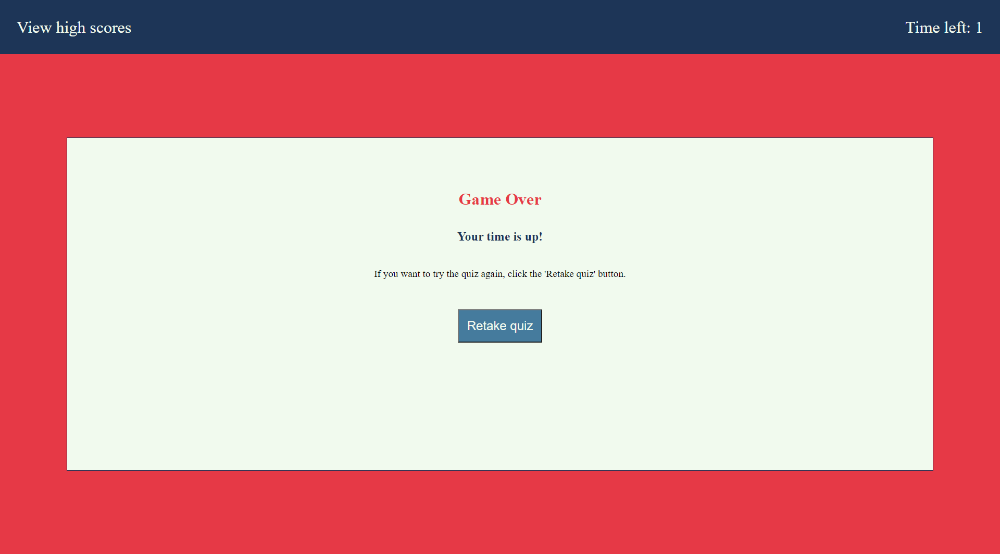

# Code Quiz | Javascript

Timed quiz on Javascript fundamentals that stores the high-scores.

## Description

In this application, I created a code quiz meant to check the user's knowledge of JavaScript fundaments.

## User Story

```
AS a user
I WANT to take a timed quiz on JavaScript fundamentals that stores my high score
SO THAT I can compare it with other users' high scores.

WHEN I open the application, I am presented with a start quiz container and instructions.

WHEN I click on start quiz button, I am presented with a question and timer starts

WHEN I click on an answer button:
* IF answer is CORRECT, I am displayed with another question
* IF answer is WRONG, I am deducted 5 seconds of the timer and question is displayed until I click the correct answer

WHEN all questions are answered, timer reaches 0 and a submit score container is displayed, where I am typing my 2 name initials and press submit score button. Then I can check my scores by visiting high scores page

WHEN timer reaches 0 but not all questions have been answered, I am presented with a game over container
```

## Link deployed application

Click [here](https://lianavaleria15.github.io/code-quiz/) to view to live deployed application.

## Screenshots

### Start quiz container



### Question quiz container



### Submit score container



### High scores page



### Game over container


